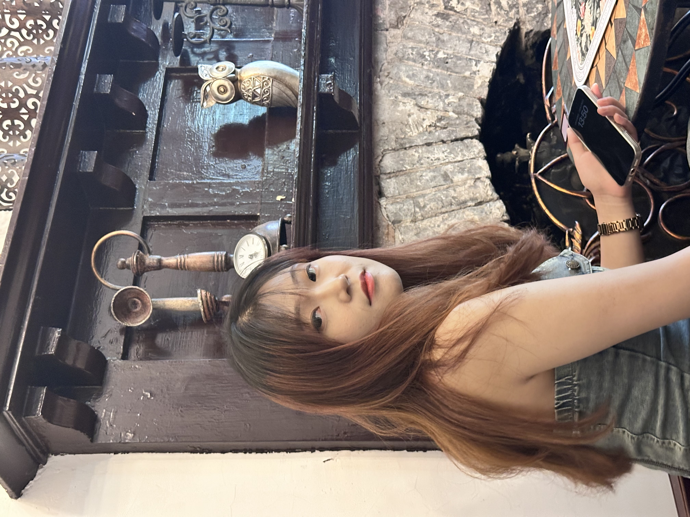
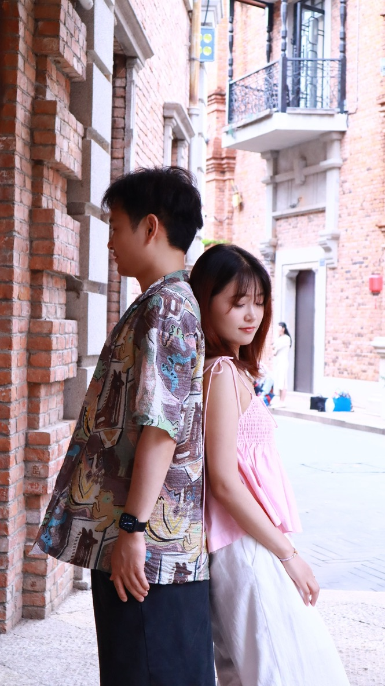
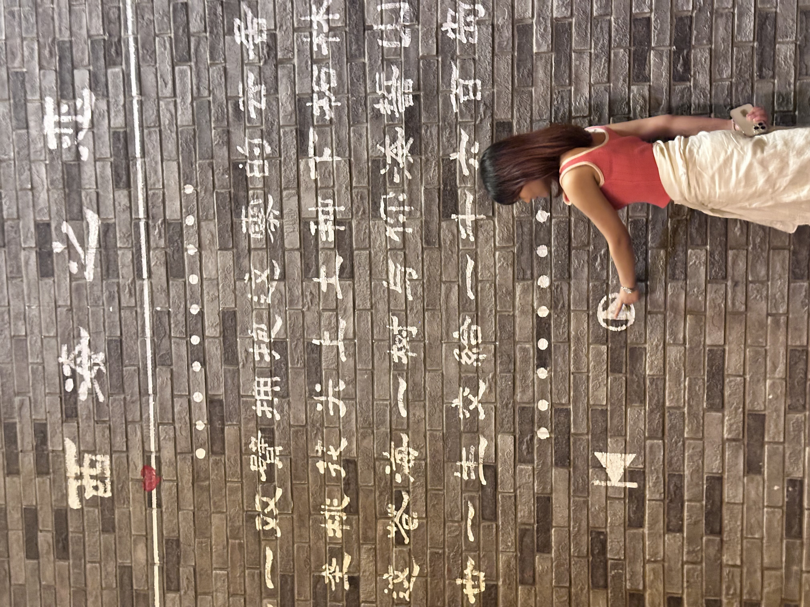

# 我的臭屁女朋友

## 初遇

人生中有些相遇是命中注定的。我们是朋友介绍认识的。第一次见面，我请她吃了潮牛壹号。那顿饭气氛很轻松，她爱吃火锅的样子让我印

象深刻。后来她总爱开玩笑说，是那顿牛肉火锅收买了她的心。

那天阳光正好，我专注地敲着代码，突然一个清脆的笑声打断了我的思绪。抬头一看，是她——我现在的臭屁女朋友。

她总是说我第一次见她时就被她迷住了，其实哪有那么夸张？不过...好吧，确实如此。

## 臭屁的日常

### 自拍狂魔

我的女朋友有个特点——超级爱自拍。每次出门，无论是吃饭、逛街还是看电影，她总能找到最佳角度和光线，然后"咔嚓咔嚓"拍个不停。

"亲爱的，你看我这个角度好看吗？"

"亲爱的，帮我拍一张嘛~"

"亲爱的，这张我是不是超可爱？"

### 购物小能手

逛街时，她总能在茫茫商海中找到"宝藏"。每次我都惊讶于她的购物技能——能在几秒钟内判断一件衣服是否值得购买，并且总能找到折扣最大的那一件。

"这件打折了！原价¥399，现在只要¥199！"

"看，我买了这么多，才花了这么点钱，是不是很厉害？"

## 可爱的小习惯

### 睡前故事

每晚睡前，她都喜欢听我讲故事。有时是我们的未来，有时是奇幻冒险，有时只是当天发生的趣事。无论多累，她总会安静地听完，然后甜甜地说一句："晚安，做个好梦。"

### 小吃货

她是个不折不扣的吃货。每次出门，她总能找到当地最好吃的餐厅。而且，她总是能在吃得津津有味的同时，保持完美的身材——这大概是我最嫉妒她的地方。

 

## 我们的旅行

我们一起去过很多地方，每次旅行都充满了欢笑和回忆。她总是能在旅途中发现最美的风景，而我则负责记录下这些美好时刻。

## 爱的小确幸

虽然她有时候确实很臭屁，总是自信满满地展示自己的才华和魅力，但这恰恰是我爱她的原因之一。她的自信、活力和对生活的热爱，总能感染我，让我的生活充满色彩。

每天早上醒来，看到她熟睡的脸庞，我都会感到无比幸福。即使她有时会因为起床气而对我发脾气，我也觉得那是世界上最可爱的事情。

## 写在最后

她可能永远不会承认自己"臭屁"，但这恰恰是她最可爱的地方。我爱她的自信，爱她的活力，爱她的一切。

在我们的故事里，她永远是那个闪闪发光的主角，而我，则心甘情愿地做她的忠实观众和最大的粉丝。

我的臭屁女朋友，谢谢你让我的生活如此精彩。
