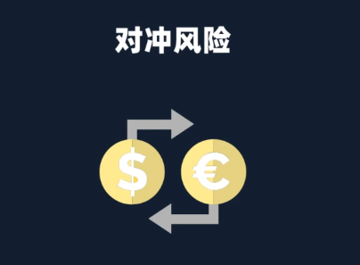

# 科学构建个人资金规划

## 一、如何做好指数基金的配置

### 配置的概念

把钱科学分配投资在不同的资产上

### 配置的意义是什么呢?

对冲风险,提高综合收益

### 定投/配置

在最大化的降低我们投资风险的基上
去获得尽可能大的收益

#### 选择成分股不重合的指数

沪深300、上证50
成分股重合
中证500、中证800
相同行业的指数

#### 选择不同风格的指数

沪深300、上证50、恒生指数这些都是属于大盘股

中证500、香港中小这些都是属于中小盘股

#### 选择不同行业,不同策略的指数

不同策略:红利、价值  、基本面、低波动
不同行业:消费、医药、金融、科技

#### 选择不同市场的指数

A股、港肢、美股

### 配置建议

#### 1、我们应该配置几支基金比较合适?

##### 建议:2-5

##### 尽量不低于两支

少于两支,起不到对冲风险的作用

##### 建议不超 过五支

1、配置太多,大部分人精力顾不过来
2、太过于分散,并不会有更多的好处

#### 2、配置的比例如何分配

配置,本质上是一件主观的事
我们需要根据自已的偏好去选择

##### 追求保守稳足型」配置大的宽基指数+策略指数

##### 追求更高收益型」加入1一2支行业指数

## 二、如何规划我们用来投资的钱

### 把钱分三份

### 我们的工资如何分配定投

### 

### 本身有一笔存款,如何分配定投

### 会出现一种情况/资金空置

第1种选择:暂时放在货币基金里,每个月定投的时候,取出一部分
第2种选择:暂时把钱放在债券基金里
第3种选择:把钱购买,半年一1年的定期理财产品
