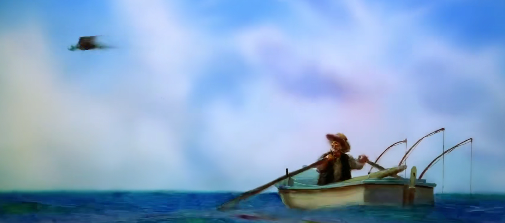
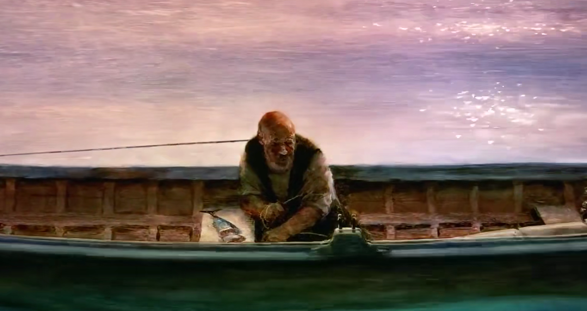
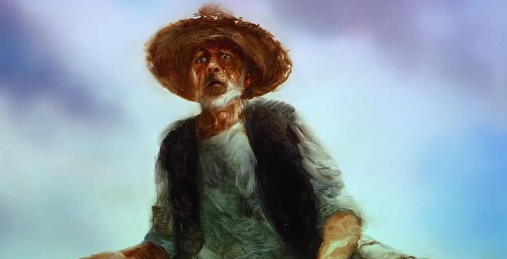
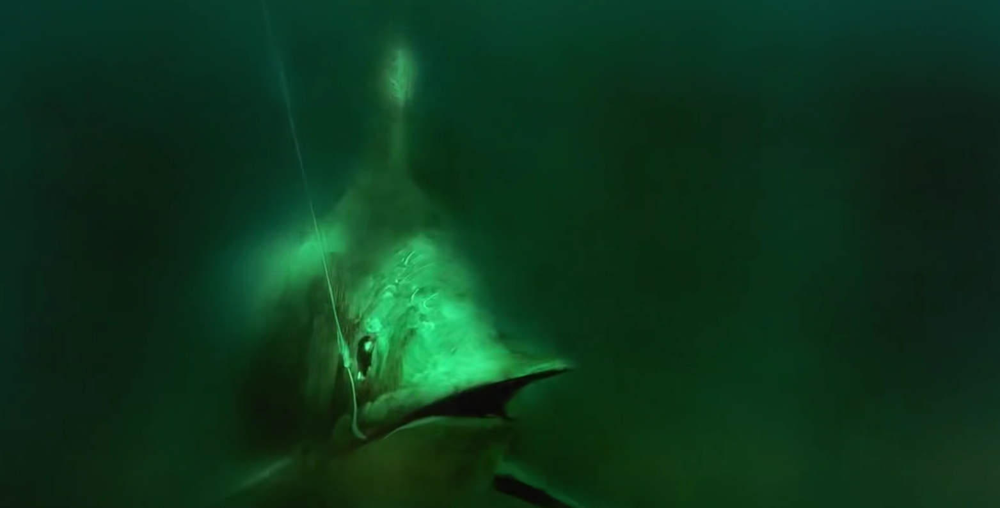
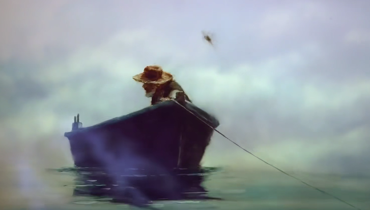
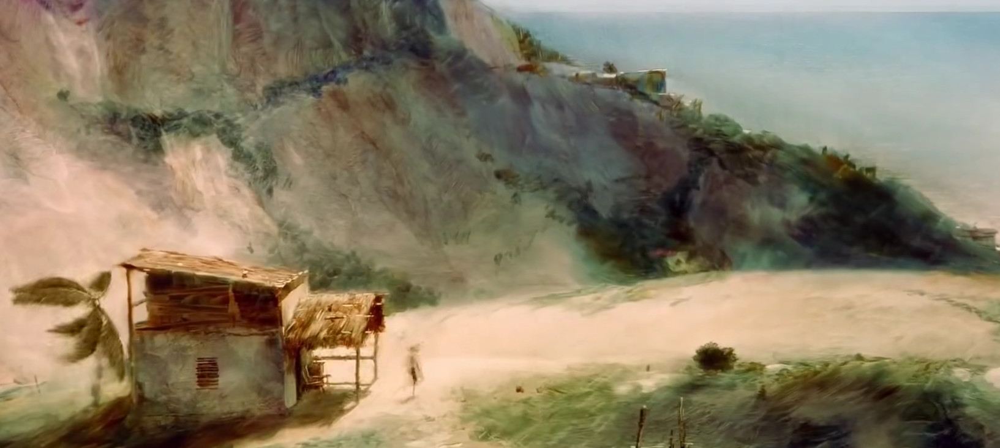

海明威在五十岁时，有记者问他，你心目中好的小说家是那些，一般作家接受这种访谈，可能都是很谦虚的夸赞别人。海明威却是这样回答的：“我很年轻的时候写小说，费了很大的力气终于超越了屠格涅夫。我再费了很大的力气，终于超越了莫泊桑；再经过了很久，我现在有自信可以写得贏司汤达，但是，仍然在眼前的那个该死的托尔斯泰，那是无法超越的。除非我继续像现在这么努力，而且维持着一直努力，那么或许还有机会。但如果真有那么一天，我超越了托尔斯泰，前面还有莎士比亚！”

然后记者跟他说， 莎士比亚是抄袭的啦，他的作品不是他本人写的啦。海明威生气的对记者说：“这个人的这些作品，我不管他叫莎士比亚还是别的什么，唯一有意义的事是——他在我之前把这些作写了，让我一点办法都没有。也就是说，海明威是把别的作家当成一个一个等着他去超越的对象。 他把写作看成和打拳击一样，你先得挑战低段位的，慢慢的才能挑战高段位的。”

他为啥是这种性格呢，因为他是真的上过战场，亲历了第一次世界大战的人。1914年一战爆发，他还是个未成年，后来到了1918年，美国正式参战， 海明威自愿入伍，那时候他还不到二十岁，他去当了运送伤病的救护车驾驶员。结果他入伍不到一个月。在意大利前线驾驶救护车的时候，他就因为炮击受伤了，炮击的碎片击中了他的腿， 他不顾身上的伤，将一个有生命危险的战友背到了救护站。然后海明威因为伤情，被转送到米兰疗伤，在那里海明威遇见了一个护士，这个护士大海明威八岁，海明威正准备跟她结婚的时候，护士却跟另一个男人结婚了。所以这段经历对海明威来说是非常痛苦的经历。

他亲历战争，用生命去思考战争的意义，他刚上战场的时候，开着救护车到处去捡尸体碎片，注意不是抬，而是捡。海明威后来回忆说: “在战场上，死亡无所不在”，然而人心中会有个奇怪的幻觉——觉得别人都可能死，随时可能死掉，但就是你自己不会。结果当被炮击碎片击中的那瞬间，海明威感受到的不是疼痛，而是自己不会死的那个幻觉消失了，他说：“原来我是会死的，我真的会死，或许下一刻我就死了。”

因为有了这种荒谬的战场经验，海明威觉得人的很多情感体验是无法用语言表达出来的。就像一个在充满暴力或者不确定因素环境下成长的孩子，长大了以后，他们的心理状态和那些拥有快乐童年的孩子是不一样的，这种人什么时候会觉得不安呢？不是有人对他大吼大叫时，不是有人对他敌视时，不是灾难临头，或是失去了宝贵的东西时。最让他不安的，是日子一切正常，一切美好，甚至生活中不断有幸福的事情发生，这种状态对于他们来说是最可怕的他们不相信自己配拥有这么美好的生活。他们害怕接下来会有神秘的力量来带走这一切。就像太宰治（<人间失格>作者）所言:胆小鬼连幸福都害怕，碰到棉花都会受伤。就是这样的极端经历，逼出了海明威的写作方式，他的作品表面上非常平静，但是底下藏着非常深层的不安。

这种不安是非理性的，是无法用叙述去表达的， 其实我们所说的东西、所写的东西，和我们脑中所想的东西是不一样的，当我们把所想的东西说岀来、写岀来以后，也就被理性整理过了一遍，也就被理性扭曲变形了，异化了，也就没有那么不安了。所以海明威不愿意把所有的信息都告诉读者，他喜欢让读者自己去联想。当我们知道这种写作背景以后，我们来看《老人与海》这部作品为什么这么伟大。

先声明一下，《老人与海》总共四万字左右，自己看完的话最多两小时不到，下面只会简单的复述剧情。

《老人与海》的叙事几乎没有高潮，故事也很简单：有一个老人，80多天没有抓到鱼。大家都嘲笑他，没人理他。因为大家认为80多天没抓到鱼的老人身上有霉运。只有一个小孩与他为伍，他没钱吃饭，饿着肚子，靠着酒吧老板救济才能勉强吃点东西，唯一的娱乐活动是看别人施舍的报纸，看看上面的棒球新闻。可是他并不失落，并不沮丧，他決定出远海抓一条大鱼，他如愿以偿了，抓到了一条比船还要大的鱼，可是这个鱼带着线，把他的小船带着跑了两天两夜，他抓着线的手被线割的血肉模糊，他不敢睡觉，只能一手抓着线， 另一只手拿一点恶心的生鱼肉来充饥，搏斗的过程中，他渐渐的敬佩起了大鱼。他甚至觉得，别人都不配吃这条大鱼的鱼肉，如果把钓索切断，与鱼断开牵连，马上就能解脱。但那意味着失败，老人脑子里从没放弃过去斗争的念头。他所想的只是，我要吃生鱼肉，我要保存体力，我要警惕自己不能睡着，又祈求起了上帝，说鱼呀，你快死掉吧，我要为你念经。后来大鱼终于体力耗尽，老人杀掉了大鱼，拖着大鱼的尸体回家，但是大鱼的血腥味吸引来了鲨鱼，鲨鱼来咬大鱼的尸体，老人用身边的工具去杀鲨鱼， 结果枪没了，刀折断了，船桨船舵都没了，鲨鱼还是源源不断。最后疲惫的老人回到了岸边，只带回了一条鱼的白骨。故事就这样结束了，很多人觉得小说枯燥， 因为在他们看来，这个故事平平无奇。

可是很多喜欢联想的人，就会觉得小说并不枯燥，虽然整部小说只有老人一个人，但是他随时随地都处于种对决的状态，大鱼是老人的对手，海洋也是他的对手。还有他老去的身体，鲜血淋漓、失去力气、抽筋的双手。都成为了他的对手。都是等他克服的困难。鱼一上钩，捕鱼经验丰富的老人立即就知道了这是怎么回事，因为他经历过太多了，他抓过太多鱼了， 但是这个鱼是他生平遇到的最强大的对手，他只能僵在那里，勉强痛苦的抓住鱼线， 但越是这样，他就觉得越不能输，他不想投降， 因为他不想被人嘲笑，他已经80多天没捕到鱼了。  

这是他改变命运的一次巨大机会，他不仅不投降，他嘴里念叨着的反而都是无关紧要的事: 比如，我要在金枪鱼没有坏掉之前赶紧吃鱼肉保存体力，我一定不能睡着，要是孩子在场就好了之类之类的话。这样写，很多人就会觉得很无聊，饿了要吃东西， 睡着了鱼就跑了，有帮手在场当然更好捕鱼， 这不是很正常吗?有必要念叨这么多遍吗?可当你的人生平平无奇，想去做一些难事，碰到了一些机遇的时候， 你就能立即知道这是怎么样的一种经验。比如说你身无分文，出去面试，面试官审视着你，但是你内心想的却是要如何注意自己的谈吐，不要说错话。比如当你碰到了很喜欢的异性，你好不容易有机会和他对话。你在心里想着的却是自己的形象是不是不得体，自己是不是看起来不自信。比如面临重大的考试，你应该仔细思考，认真做题，可是你在心里却直在嘀嘀咕咕自己不能紧张，把答案忘到了九霄云外。很多人在生活中都有过面临巨大机会，但因为自知能力有限，所以紧张兮兮的心理状态。一旦进入这种状态，你的脑中就会有一个声音不断的提醒你注意这个注意那个，就跟不断自言自语的老人是一样的状态。    

老人站在小船上，抓着鱼线，一开始，这是他和鱼之间的对决，这是他改变命运的一个机遇，可是到了后来，对决渐渐的演变成了老人与自己意志力的拉锯战了，船被大鱼拉的越来越远，没有食物没有水，面对凶险的海洋很可能无法返航， 他随时可能丧命，但是这都不重要了。他并不害怕死去，他可以放弃自己的生命，但是不能放弃这份对决关系，如果他被鱼杀了，他是能接受这个结局的，他是输得起的，但他万万不能接受的是放弃，他不能接受自己退岀。他可以被摧毁，但是他不能被打败。

对决总是有胜负的，如果说鱼最终屈服，被老人杀死拖回去了，然后老人拿去拍卖赚了一大笔钱，享受了胜利的果实，受到了人们的敬仰，那么这将是一部非常平庸的小说。而小说最精彩的部分在于大鱼死后的气味引来的鲨鱼。大鱼比船还要大两倍，所以只能绑在船边一起航行，这就引来了鲨鱼的不断掠夺，这些鲨鱼非常狡猾，又偷偷摸摸的，上来就是一大口，把老人捕到的大鱼身上的肉一大块的一大块的撕咬下去， 这些鲨鱼根本不给老人正面对决的机会。鲨鱼吃大鱼的时候，老人一边杀鲨鱼，一边对大鱼的尸体说：对不起，鱼，我很抱歉，鱼，真希望我从来不曾钓到你，一切都被弄得乱七八糟了。老人虽然不服气，他不能接受自己的成果被贪婪的鲨鱼偷掉， 他虽然战斗到手无寸铁，杀了一条又一条的鲨鱼，但是大鱼还是只剩一条白骨了。

如果说和大鱼对决是有着史诗性质的，英雄之间的公平对决。那么鲨鱼就是有着现实生活性质的，各种各样的挫折。我们都希望自己活得精彩，甚至可以接受自己堂堂正正的输在赛场上，可我们越是这样期待，我们的生活就越是容易遭遇各种挫折。这里。海明威就给我们读者留下了一个疑问。如果你是个不服输的人，却又明知人生不可能没有挫折，那么你应该如何保持内心中对胜利的渴望与向往呢？

在我们的人生中，光辉往往就那么一瞬间，剩下的都是无止尽的前行。值得庆贺的成功往往就那么几件事，剩下的都是琐碎的挫折和一道又一道的难关。于是小说第三次高潮的部分来了，小说第一次高潮，是和大鱼光明正大对决。小说第二次高潮，是遇到鲨鱼来夺取你的胜利成果。而小说的第三次高潮，就在于结尾。

上岸后，老人颤颤巍巍的回到了小屋，疲惫的睡了。一群人围绕着老人的小船，渔人去测量鱼骨的长度。“从鱼鼻到鱼尾一共十八英尺长。”，测量的人大声的说。开头出现的小孩又出现了，他跑到老人的屋子，看到老人的手，哭了起来，他马上跑去给老人弄些咖啡回来，一路上不停的哭。老人醒来后，小孩哭着问：“你受了多少罪?” 老人说:“很多。”小孩说，我们再一起去捕鱼。老人说:“这次我们得弄支锐利的鱼叉来。随时放在船上。鱼叉的刃要锋利，而且别回火处理，那样容易断。我的刀就断了。” 说实话，读到这里的时候，我的心立即被触动了。就是我觉得这个老人他内心天然有一种对胜利的渴望与向往。他很好的诠释了什么叫不屈服、生而强悍、不断超越自己的精神。
