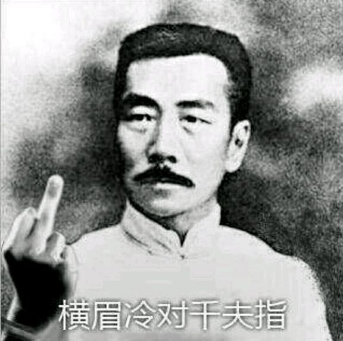

民国是中国历史上文化最多元化的一个时期，可以说是文人大佬百家争鸣。而且他们在报纸上的论战，其实是有一定表演性质的，为啥呢？因为都是文人，各个都会说话，各个都会阴阳怪气。而在报纸上公开论战，—篇文章瞬间就能显示两边的水平，所以他们写文章对喷的时候会思考，怎样把话说的俏皮？怎样骂人的时候带点幽默呢？一个逻辑怎样自圆其说的同时还能把别人驳的体无完肤呢？怎样骂才能一针见血呢？

所以这些人的论战极为精彩，不像两个没文化的人，争论起来可能三句话没说完，两边已经祖宗十八代问候起来了，沦为毫无价值的吵架了。那稍微高明一点的人吵架又如何呢？可能是不会骂娘，但也无非是诬陷、造谣、恐吓。正如鲁迅所说：辱骂和恐吓绝不是战斗！所以其实从这个方面来说，我还挺喜欢民国时期的吵架方式的。因为出现分歧，大家公开的吵，留下史料，对错全给后人去自行评判。而不像现在网上吵架，动不动就删评拉黑，然后在那自说自话给人泼脏水。

正因为民国这些人吵架的水平都很高，我们看这些论战，不仅能了解当时的历史，还能从中吸取一些经验，比如如何正确的进行思想交锋，学习到如何正确的跟人论战的方法。而鲁迅又是这批文人里面最独特的一个， 因为他吵架的时候是坚决反对虚伪的。鲁迅把中国的一些人情世故看的太透彻了，他太懂—些人的小聪明小心眼了，他就是要亳不留情的撕破这些东西。

比如有一次鲁迅跟李四光骂起来了，然后李四光和徐志摩故意把彼此的通信发表在报刊上。这篇文章名字叫做“结束闲话，结束废话！” 李四光先是在信里面和徐志摩吐槽，说鲁迅作为一个指导青年的人，非要彼此辱骂，把社会都变得恶劣起来了，然后徐志摩就回信说，大学的教授们都是负责指导青年重责的前辈呀，不应该这样混斗呀，这不仅是绅土不绅士的问题，这是像受教育人不像受教育人的问题。然后在信的结尾徐志摩是这样写的：

```
带住！让我们对着混斗的双方喝猛一声。带住！
让我们对着我们自己不十分上流的根性猛喝一声。
假如我们觉得胳膊里有余力，身体里有余勇要求发泄时，
让我们望升华的道上走，现在需要勇士的战场多着哪，
为国家，为人道，为真正的正义---
别再死捧着显微镜，无限放大你私人的意气！
再声明一句，本刊此后再不登载对人攻击的文字。


志摩发表在一九二六年二月三日《晨报副刊》
```

大家一看到这，肯定会觉得，哎呀志摩哥哥好棒呀，你们不许黑我的志摩哥哥，他在发光啊啊啊啊啊啊。awsl抱走我家志摩哥哥。啊不开玩笑，其实我们单独看，他这些话说的挺有道理的。本来互相混斗，对双方都没有好处，我们应该去做一些更有意义的事情，听起来还挺公允的是吧。

但是咱们要了解一下这个事儿的背景，这个通信发表于1926年2月3日。可是在1926年1月30日呢，也就是几天之前，这个《晨报副刊》刊载了徐志摩的《关于下面一束通信告知读者们》还有陈源的《闲话的闲话之闲话引出来的几封信》这两封信的内容是什么呢？都是攻击鲁迅的。因为1月30号的这份《晨报副刊》，全部的篇幅一共就只有这两封信。所以这两封信当时被看作是“陈源和徐志摩两个人凑成的攻周专号” 也就是说鲁迅刚被徐志摩他们岀了整整一期报纸骂没过几天，还没有来得及反驳，徐志摩又跑出来劝鲁迅和别人的架要他“带住”了，而且看似是劝架其实暗中讽刺鲁迅不像个受教育的人，讽刺他是个意气用事的小人。好话全给他说完了，这难道能叫公允吗，这尼玛能忍。鲁迅当然懂这些小心眼，但真的挺气人的，要是我被这样阴阳怪气搞一道，我哪有心情对喷，恨不得直接去找他真人PK了。鲁迅就写了一篇文章回击，标题是《我还不能“带住”》：

```
一月三十日《晨报副刊》上满载着一些东西，
现在有人称它为“攻周专号”，
真是些有趣的玩意儿，倒可以看见绅士的本色。
不知怎的，今天的《晨副》忽然将这事结束，照例用通信，
李四光教授开场白，徐志摩“诗哲”接后段，
一唱一和，甩道“带住！让我们对着混斗的双方猛喝一声，带住！”了
还“声明一句，本刊此后不登载对人攻击的文字”云。
……
……
“诗哲”所说的要点，似乎是这样闹下去，要失了大学教授的体统，
丢了“负有指导青年重责的前辈”的丑，使学生不相信，青年不耐烦了。
可怜可怜，有臭赶紧遮起来。
“负有指导青年重责的前辈”，有这么多的丑可丢，有那么多的丑怕丢么？
用绅士服将“丑”层层包裹，装着好面孔，就是教授，就是青年的导师么？
中国的青年不要高帽皮袍，装腔作势的导师;要井无伪饰，—倘没有，也得少有伪饰的导师，
倘有戴着假面，以导师自居的，就得叫他除下来，否则，便将它撕下来，互相撕下来。
撕得鮮血淋漓，臭架子打得粉碎，然后可以谈后话。这时候，即使只值半文钱，却是真价值;
即使丑得要使人“恶心”，却是真面目。
暗一揭开，便又赶忙装进缎子盒里去，虽然可以使人疑是钻石，
也可以猜作粪土，纵使外面满贴着好招牌，法兰斯呀，萧伯讷呀，……毫不中用的！
……
……
“诗哲”为援助陈源教授起见，似乎引过罗曼罗兰的话，
大意是各人的身上都有鬼，但人却只知道打别人身上的鬼，
没有细看，说不清了，要是差不多，
那就是一并承认了陈源教授的身上也有鬼，李四光教授自然也难逃。
他们先前是自以为没有鬼的。假使真知道了自己身上也有鬼，“带住”的事可就容易办了。
只要不再串戏，不再摆臭架子，忘却了你们的教授的头衔，且不做指导青年的前辈，
将你们的“公理”的旗插到“粪车”上去，
将你们的绅士衣装抛到“臭毛厕”里去，除下假面具，
赤条条地站出来说几句真话就够了！
……
……
```

这就是鲁迅独特的地方，他这篇回应发挥了一贯的反虚伪精神，而且可以说已经超越了具体的纠纷事件，骂了当时整个中国社会上文人都喜欢摆架子虚伪的现象，就是我对自己都毫不留情的解剖了，你就别搁这跟我谈什么架子，面子，派头这些虚头八脑的玩意了，这都是你们的伪装，这种伪装只是为了维持你们自己的上流地位，我全给你撕下来。

这里还有一个点很有意思，鲁迅把徐志摩称之为“诗哲“，这是鲁迅一贯的反讽，是用来挖苦人的话。除了“诗哲”，还有学者专门统计了鲁迅与别人论战的文章，统计鲁迅骂人的形容词，画风是这样的：“正人君子” “绅士” “叽儿狗”  “资本家的乏走狗” “鹰犬” “洋场恶少” “才子+流民” 这里面很多词当然也是反讽，但是我们看这些词，那简直大温柔了。

那些鲁迅的论敌是如何形容鲁迅的呢？鲁迅的论敌：“学匪” “学棍” “赤色作家” “汉奸” “双重反革命” “法西斯蒂” “买办” “日探” “收了俄国的卢布” “是需要被‘实际解决掉的人” “右倾” “危害联合战线” “助长恶劣的倾向”

这种扣帽子的形容词对于鲁迅可都是暗含杀机的，是可能会让鲁迅遭到通缉、撤职、逮捕、监禁乃至杀头的构陷与谣言。也就是说，他的很多论敌是希望借助政治权力来打倒鲁迅的。鲁迅骂人家是走狗，是帮凶，那也是和他们主子划出了界限的，这样一对比，鲁迅简直太宽容了，而鲁迅的论敌都在骂鲁迅刻毒，以彰显自己的宽容，文章见人品，你们仔细想想，这到底是谁刻毒，谁宽容。

还有1931年，国民党的大小报利上面盛传鲁迅已经被捕了，被刑讯了，还有些人在报纸上揭露鲁迅所谓的罪状，并且透露鲁迅的住址请当局加以搜捕。鲁迅给别人的信里说：老母饮泣，挚友惊心。后来为了预防遭到不测，不得不搬家避难。

有个人叫傅东华，他跟鲁迅对骂过，不过他活到了1971年，他在鲁迅死后很多年这样说：“谁谁要说鲁迅先生的精神成分里只有‘恨′而没有爱，我就和他拼命！谁要把鲁迅先生的哲学解释为唯恨哲学，我就永远痛恨那个人！” 连鲁迅的对头都这样说，那些总污蔑鲁迅刻毒的人是什么居心就不言自明了。

我们很多人觉得，鲁迅总是爱骂人，总是在批判社会，人很刻薄，是个睚眦必报的性格，但其实这种看法很片面。鲁迅的母亲鲁瑞这样说过：大先生所以死得这么早，都是因为太劳苦，又好生气。他骂人虽然骂的很厉害，但是都是人家去惹他的，他在未写骂人的文章以前，自己已气得死去活来，所以实在是气极了才骂人的。鲁迅一生被骂的次数远比骂人的次数多得多，但是他是那一批人里面最出彩的那一个，而他论敌的文章多数早就飞灰湮灭了，所以我们才得出他很刻薄的印象。

我举个例子，你跟我在贴吧或者B站对喷，我俩喷了几百楼。然后你把你的楼层全部删掉了，只留下我的，人家路人一看。只剩下我个人在那自顾自的骂，路人们肯定就会觉得我像一个自已在那发神经的哈批。鲁迅曾经也说了这个话题。大概是说，如果只留下一方的文章，没有对比，那么当时的论战文章，就都好像无的放矢，独个人在向着空中发疯。我常见别人评论古人的文章，说谁锋芒太露，谁剑拔弩张，就是因为对面的文章完全消灭了的缘故。

鲁迅生前想编一本《围剿集》，就是想把论战对手的文章也附录在里面。因为大家都说他喜欢骂人，但是很少有人知道别人是怎么对他的。不过，这个心愿后来没有实现，因为他留下这个心愿的那一年就去世了。（2021年10月19日23:09:51 四校）
