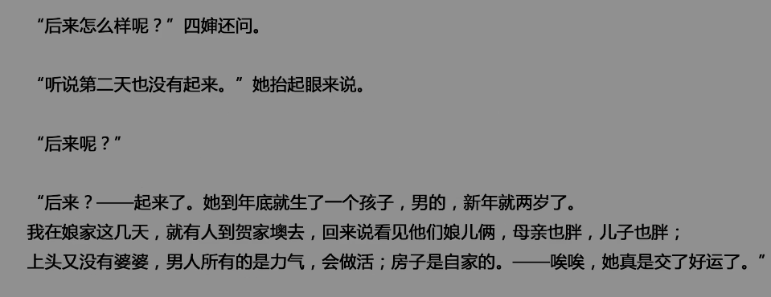

​在砖塔胡同期间，朱安46岁左右，鲁迅创作了《祝福》这篇小说，创作出到现在也是极为经典的形象，同样是40上下的祥林嫂。 虽然很少人提出这个观点，但我个人感觉，很难说这个形象没有收到朱安的影响。

​我记得没错的话，《祝福》应该在学校有教过，似乎变成了一些人讽刺那些喜欢卖惨的人的一个比喻。变成了怼人的一个形容词，甚至我们的正是发言人也拿过这个作比喻 ，说实在话，这是有点不太合适的。

​鲁迅的所有小说里，只有这篇《祝福》看了是最令我动容的，因为祥林嫂这个角色实在是太令人同情了。小说里的祥林嫂是一个童养媳，父母不知道哪去了。丈夫比他小十岁，后来丈夫死了，她和丈夫的弟弟还有婆婆一起生活。但不知为何，祥林嫂逃到了鲁镇，由中介卫老婆子领着去了鲁四老爷家当女工。

​他们先还嫌弃她是一个寡妇——但看她模样还周正。手脚都壮大,又只是顺着眼,不开一句口，很像一个安分耐劳的人，便不管四叔的皱眉，将她留下了。试工期内,她整天的做，似乎闲着就无聊,又有力，简直抵得过一个男子,所以第三天就定局，每月工钱五百文。日子很快的过去了她的做工却毫没有懈食物不论，力气是不惜的。人们都说鲁四老爷家里雇着了女工，实在比勤快的男人还勤快。到年底扫尘，洗地，杀鸡，宰鹅，彻夜的煮福礼，全是一人担当，竟没有添短工。然而她反满足,口角边渐渐的有了笑影，脸上也白胖了。“可后来，她的婆婆派了两个壮汉，趁祥林嫂在河边淘米的时候，把她抓回了山里去。鲁四老爷鲁四婶只得另聘女工，还总嫌后来聘的女工非懒即馋。左右不如意。觉得都不如祥林嫂，还非常想念祥林嫂。之后卫老婆子来鲁四老爷家拜年，和鲁四婶谈论到了祥林嫂后面的遭遇。 

​大约是得到祥林嫂好运的消息之后又过了两个新年，卫老婆子又领着祥林嫂站在鲁四老爷家门口了。

​四婶起刻还踌躇，待到听完她自己的话，眼圈就有些红了。她想了一想，便教拿圆篮和铺盖到下房去。卫老婆子仿佛卸了一肩重似的噓一口气，祥林嫂比初来时候神气舒畅些，不待指引，自己驯熟的安放了铺盖。她从此又在鲁镇做女工了。大家仍然叫她祥林嫂。

​然而这一回,她的境遇却改变得非常大。然而这一回，她的境遇却改变得非常大。上工之后的两三天。主人们就觉得她手脚已没有先前一样灵活，记性也坏得多，死尸似的脸又整日没有笑影，四婶的口气上。已颇有些不满了。当她初到的时候，四叔虽然照例皱过眉，但鉴于向来雇用女工之难，也就并不大反对，只是暗暗地告诫四婶说，这种人虽然似乎很可怜，但是败坏风俗的，用她帮忙还可以，祭祀时候可用不着她沾手，一切饭莱，只好自已做，否则，不干不净，祖宗是不吃的。四叔家里最重大的事件是祭祀，祥林嫂先前最忙的时候也就是祭祀，这回她却清闲了。桌子放在堂中央,系上桌帏,她还记得照旧的去分配酒杯和筷子。

​镇上的人们也仍然叫他祥林嫂，但音调和先前很不同，也还和她讲话,但笑容却冷冷的了。她全不理会那些事，只是直着眼睛,和大家讲她自己目夜不忘的故事：

​她当时并不回答什么话，但大约非常苦闷了，第二天早上起来的时候，两眼上便都围着大黑圈。早饭之后,她便到镇的西头的土地庙里去求捐门槛,庙祝起初执意不允许,直到她急得流泪,才勉强答应了，价目是大钱十二干。

​她大约从他们的笑容和声调上,也知道是在嘲笑她，所以总是瞪着眼睛,不说一句话,后来连头也不回了。她整日紧闭了嘴唇,头上带着大家以为耻辱的记号的那伤痕,默默的跑街，扫地，洗莱，淘米。快够一年,她才从四婶手里支取了历来积存的工钱。换算了十二元鹰洋,请假到镇的西头去。但不到一顿饭时候,她便回来,神气很舒畅，眼光也分外有神,高兴似的对四婶说,自己已经在土地庙捐了门槛了。

​冬至的祭祖时节,她做得更出力,看四婶装好祭品，和阿牛将桌子抬到堂屋中央,她便坦然的去拿酒杯和筷子。

​然而她总如此,全不见有伶俐起来的希望。他们终于打发她走了……

​祥林嫂是一个勤劳质朴善良的人，但是在封建的旧社会，她根本争不到一个做人的权力，虽然她顽强的抗争了,但最后还是被麻木的看客们的嘲弄、侮辱与伤害所吞噬。而且直到最后,她也没有觉悟过来，自己是一个封建礼教的牺牲品。我觉得但凡是一字一句读了这篇文章的，是不会拿这样一个人物作比喻去嘲讽别人的。除非是上学的时候老师教错了。

​鲁迅在砖塔胡同和朱安同处一室,创作出了这篇小说。祥林嫂和朱安都是被旧社会所迫害的女人。如果说祥林嫂这个人物真的有朱安的影子，那么鲁迅对朱安很可能也是一种悲悯的态度。这也许是他一直没有休掉朱安,并且供养的很好的原因。

